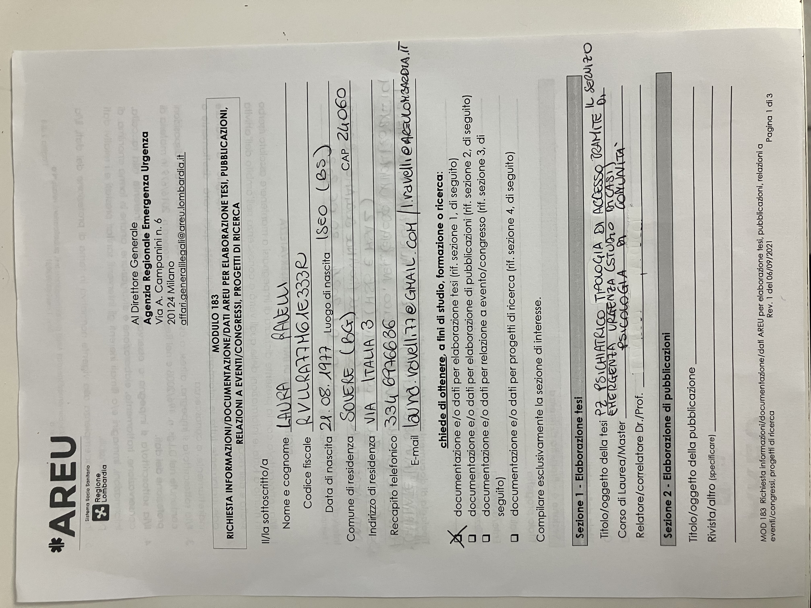
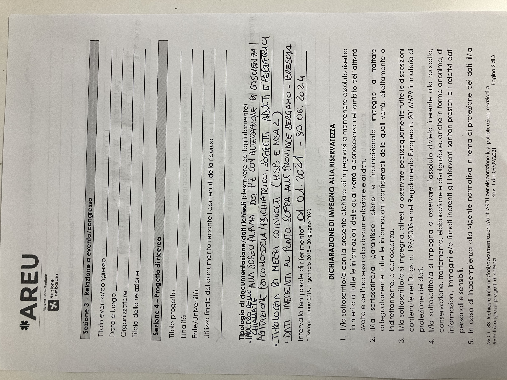
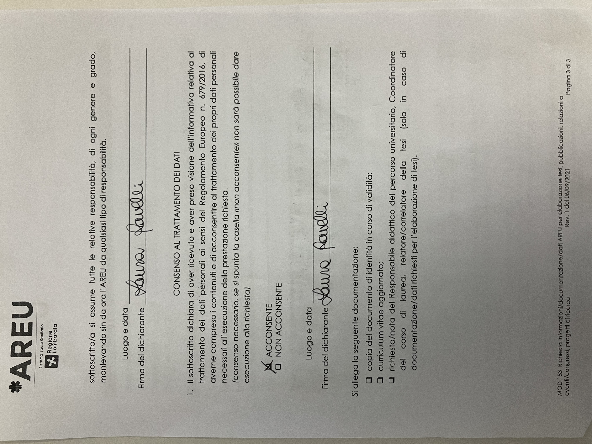

- TODO rispondere alla richiesta dati #lavoro 
  DEADLINE: <2025-01-23 Thu>
  :LOGBOOK:
  CLOCK: [2025-01-16 Thu 00:29:40]--[2025-01-16 Thu 00:29:50] =>  00:00:10
  CLOCK: [2025-01-16 Thu 00:30:43]--[2025-01-16 Thu 00:37:40] =>  00:06:57
  CLOCK: [2025-01-16 Thu 00:37:47]--[2025-01-16 Thu 00:38:44] =>  00:00:57
  CLOCK: [2025-01-16 Thu 00:41:39]--[2025-01-19 Sun 22:24:17] =>  93:42:38
  CLOCK: [2025-01-22 Wed 17:53:11]--[2025-01-22 Wed 17:53:12] =>  00:00:01
  CLOCK: [2025-01-22 Wed 17:53:14]--[2025-01-22 Wed 17:53:17] =>  00:00:03
  CLOCK: [2025-01-22 Wed 17:54:22]--[2025-01-22 Wed 18:00:29] =>  00:06:07
  :END:
- Prendere contatto #B
	- chiedere informalmente a [[Pagliosa_ANDREA]]
	- Risposta 2
		- ```
		  Dimenticavo ti lascio il numero  
		  3346976636  
		  Grazie
		  ```
	- Risposta 1
		- ```
		  Ciao, grazie per la disponibilità. 
		  Domani sono di turno in Bianca a Bergamo dalle 21 in poi. Dal 27 riprendo a lavorare sull’MSA1 di Palazzolo. Se sei di turno posso passare (se transito al Papa Gio) ma non voglio disturbare; comunque mi servono i dati statistici che hai inerenti al triennio 2021/2024 che riguardano soggetti psichiatrici (adulti e pediatrici) e/o con agitazione psicomotoria per i quali è stato necessario l’intervento di MSA2 (per eventuali sedazioni o meno). Non ho pretese, vedi tu quello che hai, non ho nemmeno fretta perché ho tutto il 2025. Grazie della cortese collaborazione Laura
		  ```
	- Mail
		- ```
		  Buonasera,
		  sono Togni Ivan, infermiere presso Soreu Alpina, mi è stato affidato il compito di fornirle i dati di cui necessita.
		  Ho letto la sua richiesta ma non mi è chiarissimo cosa le serve, le propongo se ne ha la possibilità di incontrarci in SOREU in modo da poterle mostrare cosa viene inserito e, quindi, può essere estratto.
		  Cordiali saluti
		  Ivan Togni
		  ```
	- ```
	  Salve dott.ssa Sforza,
	  sono Ravelli Laura (matr.2756 - autista presso AAt Bs), le inoltro la richiesta che avevo fatto ad Affari Generali di AREU come mi aveva indicato come procedura per avere dei dati al fine di elaborare la tesi (indicativamente per marzo 2026). La risposta è arrivata ieri e nella richiesta avevo indicato dei dati chiari e ben precisi per evitare ambiguità ma ammetto che non ho nemmeno io ben chiaro a quali dati posso aver accesso in termini di SOREU, quindi veda Lei che cosa può darmi ma soprattutto che dati possiede.Una cortesia, avendo fatto la richiesta a settembre 2024 ho scritto come periodo di riferimento il triennio fino a giugno 2024; se potessi avere i dati relativamente a tutto il 2024 sarebbe l'ideale, i dati non mi servono nel breve tempo, si riservi pure la facoltà di prendersi tutto il tempo che vuole,nel frattempo ho ben altro da fare (studiare). Se varò modo di passare in SOREU Alpina per qualsiasi svariato motivo passo per ringraziarla di persona. Le lascio il mio numero di cellulare per qualsiasi informazione: 3346976636.
	  La ringrazio anticipatamente per la disponibilità Ravelli Laura
	  ```
	- ![CC_952_LETTERA_PROT_2025_952.pdf]
		- 
		- (../assets/CC_952_LETTERA_PROT_2025_952_1736983943725_0.pdf)
		- 
		- 
		-
	-
-