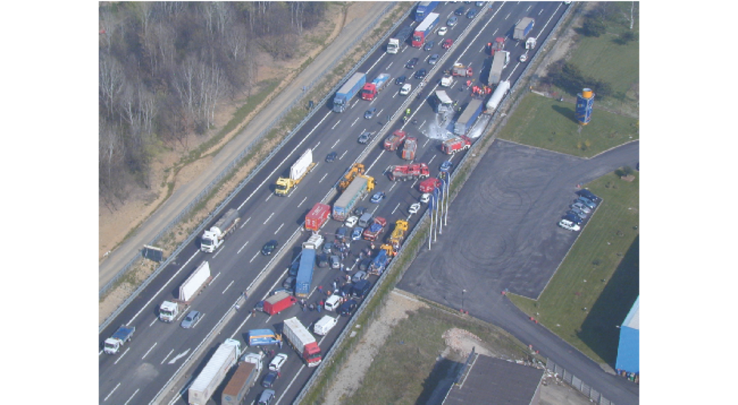
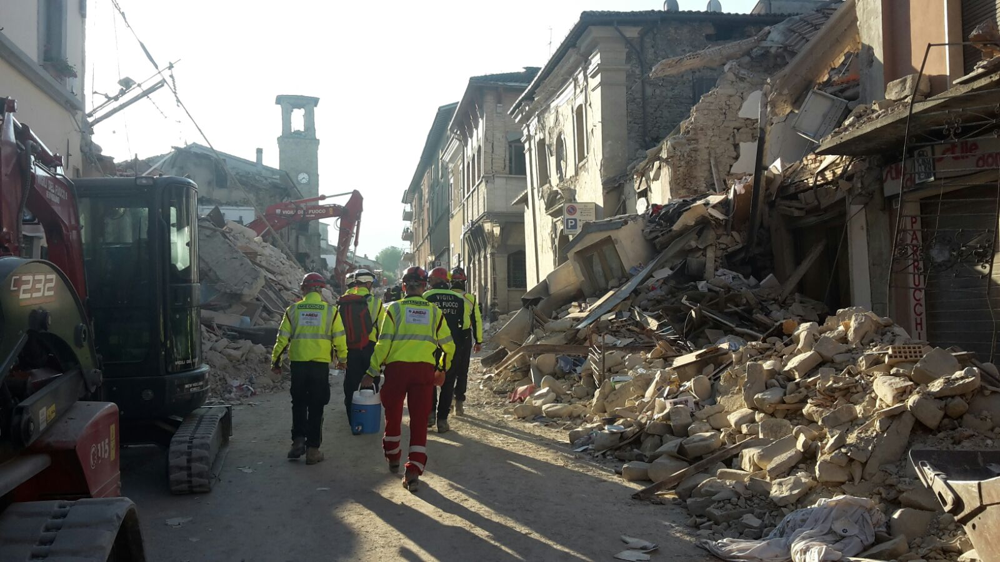
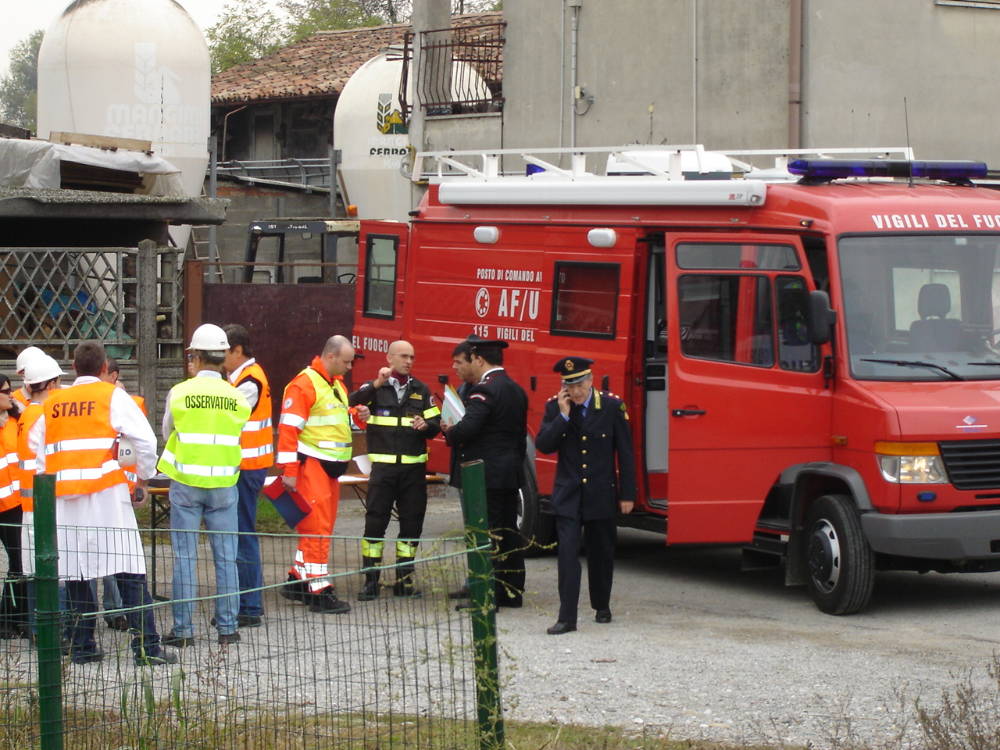
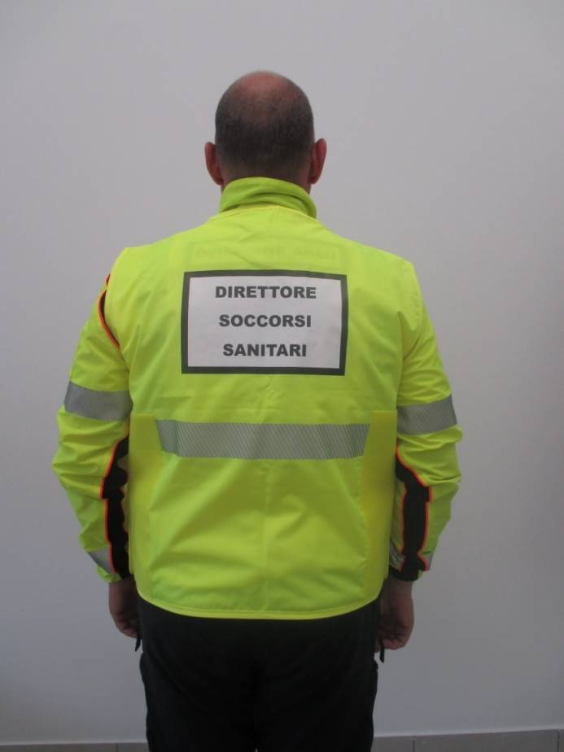
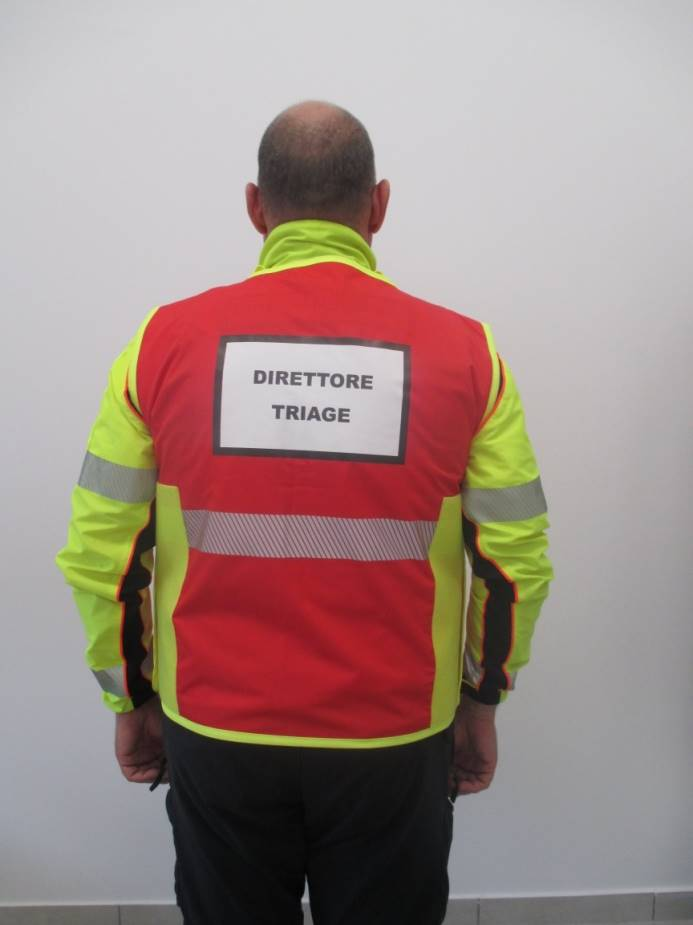
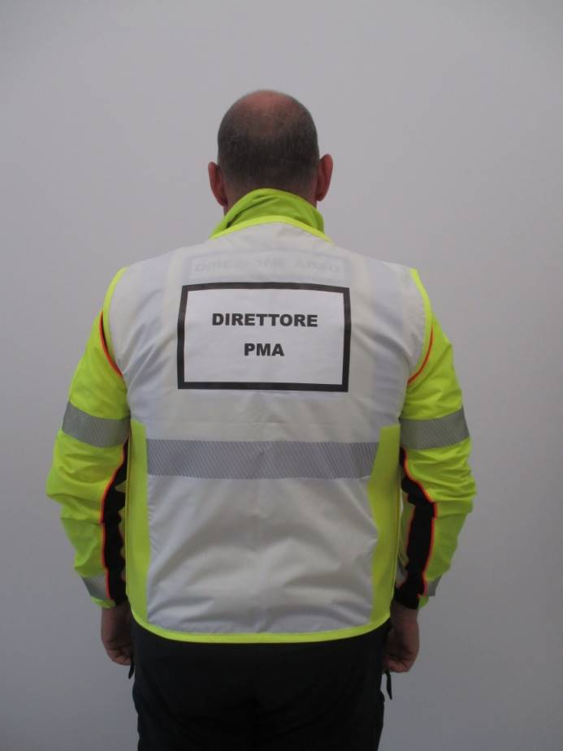
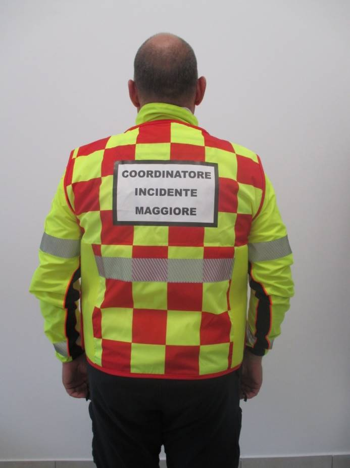

- [[Lezione @Treviolo]][[Maxi]] /todo 09-04/2024 20:30
	- Tempo 2:30 hr
	- Programma
		- cosa è la maxiemergenza
			- aspetti legislativi
				- Imprevisto
				  Violento e improvviso
				  Dimensione 
				  Danni umani e materiali
			- Strategia
				- Piani
			- Logistica
				- Risorse
			- Tattica
				- Applicazione
			- Evento catastrofico ad effetto limitato
				- SINONIMO DI MAXIEMERGENZA 
				  ED INCIDENTE MAGGIORE
			- 
			- Evento catastrofico che travalica le potenzialità di risposta locale
			- 
			- Squilibrio
			- Piano generale
			- Piani specifici
			- Consolle maxi
				- numero 0
		- Teoria
			- Definire un evento maggiore e le caratteristiche che ne condizionano il soccorso
			  background-color:: green
			  Identificare i riferimenti legislativi in caso di eventi maggiori
				- **«Criteri di Massima per l'Organizzazione dei soccorsi Sanitari nelle Catastrofe»
				  **Il
				   presente allegato, contenente i criteri di massima per l'organizzazione
				   dei soccorsi sanitari nelle catastrofi, è stato pubblicato nella 
				  Gazzetta Ufficiale 12 maggio 2001, n. 109, S.O.
			- Identificare i ruoli della SOREU e dell’AAT e delle diverse strutture di coordinamento locale in caso di evento maggiore:
				- Posto di Comando Avanzato
				- 
				- Centro Coordinamento Soccorsi
					- Prefettura
				- Centro Operativo Misto
			- Definire il concetto e lo scopo del triage, i codici colore e il metodo start
			- Conoscere le funzioni del
				- Direttore Soccorsi Sanitari
					- 
				- Direttore Triage
					- 
				- Direttore dei Trasporti
					- 
				- Direttore del PMA
					- 
			- CIM
				- 
			-
			- Comprendere i criteri di priorità di trattamento e di scelta di evacuazione nelle emergenze multiple
		- Pratica
			- Interagire efficacemente con le strutture di coordinamento
			- Svolgere i compiti della prima squadra MSB che giunge sul luogo di un evento maggiore
			- Utilizzare la busta per le maxi emergenze
			- Effettuare una ricognizione della scena e di tutti i feriti per comunicare alla SOREU la dimensione del problema
			- Realizzare una veloce classificazione dei feriti secondo i codici colore eseguendo le prime manovre a sostegno delle funzioni vitali (posizione del capo, pervietà vie aeree, tamponamento emorragie, allontanamento dai pericoli)
			- Utilizzare i sistemi di riconoscimento triage in dotazione sui mezzi di basse
			- Cooperare con il personale sanitario al triage, la SOREU e gli altri soggetti deputati al soccorso nell’attuare i piani di risposta alla maxiemergenza
			- Fornire alla SOREU e alle forze presenti sul posto tutte le informazioni necessarie per fare un uso razionale delle risorse disponibili